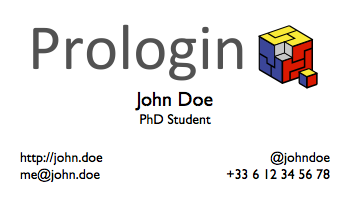

# Business Card

In March 2014, I attended the 1st [Learning at Scale conference](http://learningatscale.acm.org/las2014/).  
In the subway, some nice guy told me I **had to** make business cards for the conference. So I went to some [kinko](https://en.wikipedia.org/wiki/FedEx_Office) and asked:

- How much for 250 business cards?
- $69.
- If I provide a PDF and just ask you to print and cut, can you do it for today?
- Yes.
- How much?
- $39. Do you have the file?
- Yes.

It was a lie. I opened a new LaTeX document and typed this thing, thanks to Stack Overflow.

## Requirements

- XeLaTeX
- Gill Sans, but you can change the font

## Build

    xelatex card

## License

AGPLv3 because I like to force people to be free.

© 2017 Jill-Jênn Vie
